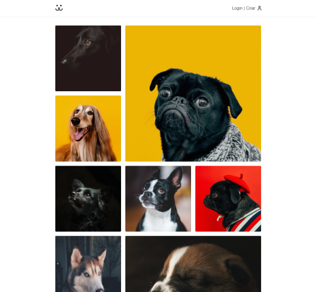

<div align="center" id="top"> 
  

&#xa0;

<a href="https://dogs.matheusbronca.com">Demo</a>

</div>

<h1 align="center">Reactdogs</h1>

<p align="center">
  

  

  

  

  <!--  -->

  <!--  -->

  <!--  -->
</p>

<!-- Status -->

<!-- <h4 align="center">
	🚧  Reactdogs 🚀 Under construction...  🚧
</h4>

<hr> -->

<p align="center">
  <a href="#dart-about">About</a> &#xa0; | &#xa0; 
  <a href="#sparkles-features">Features</a> &#xa0; | &#xa0;
  <a href="#rocket-technologies">Technologies</a> &#xa0; | &#xa0;
  <a href="#camera-screenshots">Screenshots</a> &#xa0; | &#xa0;
  <a href="#white_check_mark-requirements">Requirements</a> &#xa0; | &#xa0;
  <a href="#checkered_flag-starting">Starting</a> &#xa0; | &#xa0;
  <a href="#memo-license">License</a> &#xa0; | &#xa0;
  <a href="https://github.com/matheusbronca" target="_blank">Author</a>
</p>

<br>

## :dart: About

Reactdogs is the final project of <a href="https://www.origamid.com/curso/react-completo/">Origamid React Course</a>. This project has several improvements compared to the initial Origamid project design by the way.
You can see all the new features added in the features section below.

## :sparkles: Features

:heavy_check_mark: User authentication; (original)\
:heavy_check_mark: New accounts; (original)\
:heavy_check_mark: New posts; (original)\
:heavy_check_mark: Delete posts; (original)\
:heavy_check_mark: Posts stats; (original)\
:heavy_check_mark: Infinite scrolling; (original)\
:heavy_check_mark: Image lazy loading, placeholder feature without layout reflow; <b><i>(new)</i></b>\
:heavy_check_mark: Custom router redirects accordingly the user inputs for better UX; <b><i>(new)</i></b>\
:heavy_check_mark: General UI improvements, especially on mobile devices; <b><i>(new)</i></b>\
:heavy_check_mark: General UX improvements, especially on mobile devices; <b><i>(new)</i></b>\
:heavy_check_mark: Full responsiveness, all mainstream devices supported; <b><i>(new)</i></b>

## :rocket: Technologies

The following tools were used in this project:

- [React](https://pt-br.reactjs.org/)
- [Victory](https://formidable.com/open-source/victory/)

## :camera: Screenshots



## :white_check_mark: Requirements

Before starting :checkered_flag:, you need to have [Git](https://git-scm.com) and [Node](https://nodejs.org/en/) installed.

## :checkered_flag: Starting

```bash
# Clone this project
$ git clone https://github.com/matheusbronca/reactdogs

# Access
$ cd reactdogs

# Install dependencies
$ yarn

# Run the project
$ yarn start

# The server will initialize in the <http://localhost:3000>
```

## :memo: License

This project is under license from MIT. For more details, see the [LICENSE](LICENSE.md) file.

Made with :heart: by <a href="https://github.com/matheusbronca" target="_blank">Matheus Bronca</a>

Original project design by <a href="https://github.com/origamid" target="_blank">André Rafael</a>

&#xa0;

<a href="#top">Back to top</a>
